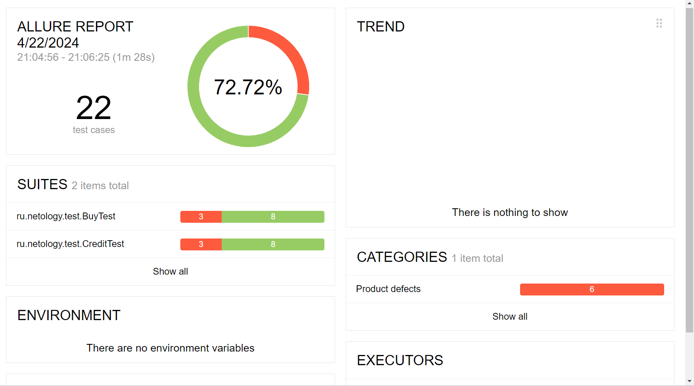

## Отчет по итогам тестирования

### 1. Краткое описание
Целью дипломной работы было тестирование функциональности веб-сервиса по покупке тура. Главной задачей было автоматизировать позитивные и негативные сценарии покупки тура. Для реализации тестирования был составлен план работ, подготовлено тестовое окружение и написаны соответсвующие тест-кейсы 

### 2. Количество тест-кейсов
Общее количество тест-кейсов - 22:
* успешных - 16 (72,72%)
* неуспешных - 6 (27,28%)
 

### 3. Общие рекомендации
1. Устранить [дефекты](https://github.com/ktshva/QA_Diplom/issues);
2. Составить подробную документацию к сервису с описанием поведения каждого функционала